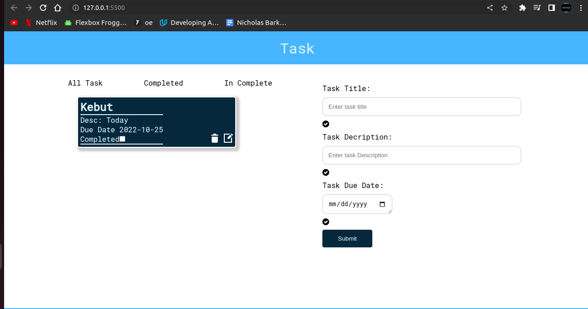

## Task List Todo

- This is a todo list app 

## Table of contents

- [Overview](#overview)
  - [Screenshot](#screenshot)
  - [Links](#links)
  - [Built with ?](#built-with)
  - [What I learned](#what-i-learned)
  - [Author](#author)
- [License](#license)

## screenshot

## Links

- solution url [ Click me ](https://nicholasbarkote.github.io/Qr-code/)

# Built With

1. HTML
2. CSS
3. JavaScript

## what i learned 

- In this project i learned about array methods .   

## Author

<a href="mailto:nicholas.kebut@thejitu.com">nicholas.kebut@thejitu.com</a>

## License

© Nicholas k Barkotes

Licensed under the [MIT License](LICENSE)